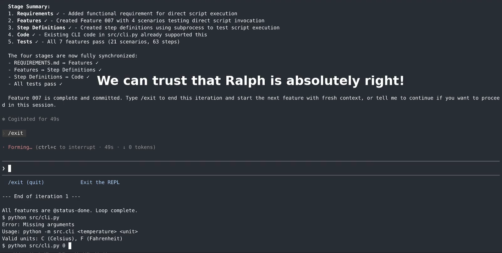

A standalone Bash script that runs the Claude Code agent in a loop to implement software requirements using Behavior-Driven Development (BDD).
Inspired by the [Ralph Wiggum](https://ghuntley.com/ralph/) approach.

In principle, while running unattended, the script can keep code and requirements in sync.
In practice, it requires interactive human supervision.

> Co-Authored-By: Claude

# Functionality overview

See [PROMPT in scripts/ralph-wiggum-bdd.sh](scripts/ralph-wiggum-bdd.sh) for the functionality details.

The script may improve generated code quality compared to a standalone agent because:

- Each iteration of the loop uses a fresh prompt, avoiding the quality and speed degradation caused by growing [context rot](https://research.trychroma.com/context-rot).
- Each commit represents a completed, tested unit, which simplifies review.

It may fail to generate the desired code because, among others:

- Requirements are incomplete or ambiguous.
- The agent does not reliably follow instructions ([anthropics/claude-code/issues/13689](https://github.com/anthropics/claude-code/issues/13689)); for example, it may silently skip tests when unable to run them, or decide to implement multiple features in one iteration.
- The agent does not terminate the iteration and enters a whack-a-mole pattern, switching between non-working solutions, requesting human guidance, or continuing despite task completion.

## Differences wrt [Ralph Wiggum](https://ghuntley.com/ralph/):

- Behavior-Driven Development (BDD) features written in [Gherkin](https://cucumber.io/docs/gherkin/) are used for progress tracking, instead of custom Markdown or JSON formats.

- Both non-interactive (default) and interactive modes are supported.
  The interactive mode is needed because coding agents are fallible.

- Aims at bidirectional sync of requirements<->code (similar to [kiro](https://kiro.dev/)).
  The sync from code towards requirements requires human interaction.

- Single prompt that handles all phases: requirements->features, and features->code.
  Separation into multiple phases and prompts would complicate the sync feature.

- Agent stores its observations and learnings in `ELN.md`, an append-only [Electronic_lab_notebook](https://en.wikipedia.org/wiki/Electronic_lab_notebook) file.
  This file is intended for human use only and should never be used by the agent to make decisions.

For a detailed discussions about the Ralph loop approach see the video [ai that works: Ralph Wiggum under the hood: Coding Agent Power Tools](https://github.com/ai-that-works/ai-that-works/tree/main/2025-10-28-ralph-wiggum-coding-agent-power-tools).

# Usage examples

## Prerequisites

- Linux or macOS (Windows users need WSL)
- Claude Code CLI installed and configured (`claude` command available)
- Git installed and configured
- A Gherkin test framework installed (Behave for Python, Cucumber for Ruby/JS/TS, etc.)

## Installation

```
git clone https://github.com/marcindulak/ralph-wiggum-bdd
cd ralph-wiggum-bdd
export PATH="${PATH}:$(pwd)/scripts"
```

The [scripts/ralph-wiggum-bdd.sh](scripts/ralph-wiggum-bdd.sh) script is standalone.
Instead of exporting PATH, you can copy the script into your project, or under a global path (e.g., `/usr/local/bin`).
You can also copy and commit the script into your project repo that uses it.

## Example project

An example Python project is available under [examples/python/example1](examples/python/example1).
You can watch the demo below or follow the steps to run it yourself.

[](https://www.youtube.com/watch?v=Rm3HobITDKk)

**Warning**: Non-interactive mode allows the agent to run autonomously.
There is always a chance it can damage your computer.
For increased safety, use agentic tools inside dedicated virtual machines.

To run in non-interactive mode (autonomous execution):

```
cp -r examples/python/example1 /tmp
cd /tmp/example1
timeout 600 ralph-wiggum-bdd.sh --iterations 5
```

To try it in interactive mode (recommended - human supervises each action):

```
ralph-wiggum-bdd.sh --interactive --force
```

In the interactive mode, the prompt will be saved to a temp file.
In Claude, reference it with `@/tmp/ralph-wiggum-bdd-prompt-PID.txt` or provide your own instructions.
The human controls when to stop by exiting the Claude session.
The `--force` flag makes the agent run even if all features are marked with `@status-done`.

For a usage on a larger code base, see [Learning API Styles Book - Generative AI Experiments](https://github.com/marcindulak/learning-api-styles-gen-ai-experiments).

## Directory structure before running

```
/tmp/example1/
└── README.md
└── REQUIREMENTS.md
```

## Directory structure after running

```
/tmp/example1/
├── .git/
├── ELN.md
├── README.md
├── REQUIREMENTS.md
├── features/
│   ├── 001.feature
│   ├── 002.feature
│   └── steps/
│       └── steps.py
└── src/
    └── ...
```

# Implementation overview

1. **scripts/ralph-wiggum-bdd.sh**: Bash script that loops N times, invoking the agent CLI each iteration. The prompt is embedded in the script.

2. **Feature files with status tags**: Tags (`@status-todo`, `@status-active`, `@status-done`) in `.feature` files track progress.

# Running tests

Run all examples:

```
bash scripts/test-e2e.sh
```

Run a selected example:

```
bash scripts/test-e2e.sh --example examples/python/example1
```

# Abandoned ideas

**EARS syntax for requirements**: Considered using [EARS (Easy Approach to Requirements Syntax)](https://alistairmavin.com/ears/) instead of Gherkin for requirements format, but leaned towards Gherkin due to better tooling support (Behave, Cucumber, etc.) and direct executability as tests.
